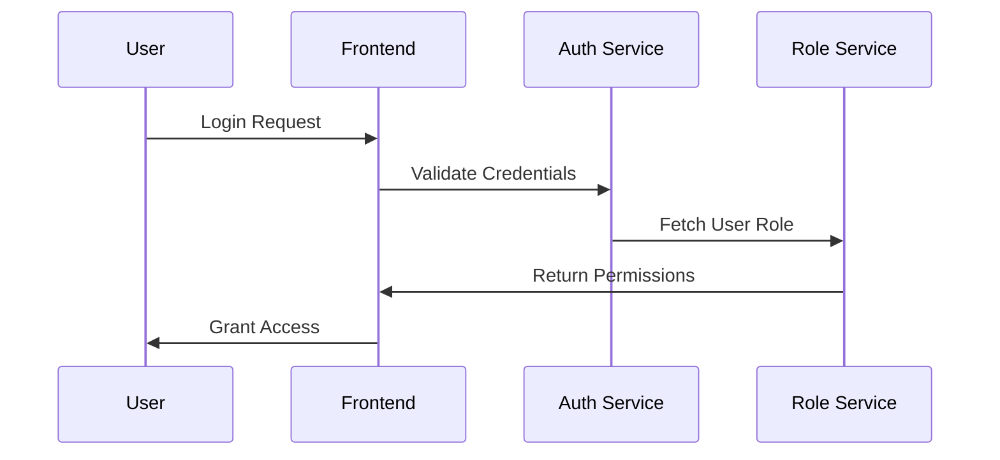
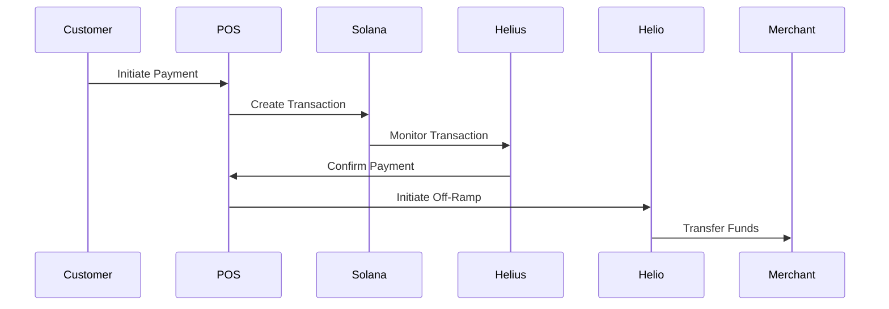

# System Architecture Documentation

## Overview
This document provides a comprehensive overview of the system architecture for the Clover POS App with Solana Pay and Off-Ramp Gateway integration.

## System Components

### 1. Frontend Layer
```
src/
├── components/     # UI Components
├── pages/         # Application Pages
├── hooks/         # Custom React Hooks
└── styles/        # Styling and Theme
```

#### Key Components
- **DashboardLayout**: Main application shell
- **Header**: Navigation and user controls
- **Sidebar**: Role-based navigation menu
- **TransactionViewer**: Payment processing interface

### 2. Business Logic Layer
```
src/
├── lib/           # Core Business Logic
├── utils/         # Utility Functions
└── hooks/         # Business Logic Hooks
```

#### Core Services
- Payment Processing
- Transaction Management
- User Authentication
- Role-Based Access Control

### 3. Integration Layer
```
src/
├── helius/        # Helius Integration
├── helio/         # Helio Integration
└── clover/        # Clover POS Integration
```

#### Integration Points
- Solana Blockchain
- Payment Processing
- Transaction Monitoring
- Off-Ramp Services

### 4. Data Layer
```
src/
├── types/         # Type Definitions
├── context/       # State Management
└── config/        # System Configuration
```

## System Interactions

### Authentication Flow


### Payment Processing Flow


## Security Architecture

### 1. Authentication
- Role-based access control
- JWT token management
- Session handling
- Multi-factor authentication support

### 2. Data Security
- End-to-end encryption
- Secure key storage
- Data validation
- Input sanitization

### 3. Network Security
- SSL/TLS encryption
- Rate limiting
- DDoS protection
- API authentication

## Performance Considerations

### 1. Caching Strategy
- In-memory caching
- Browser caching
- API response caching
- Static asset caching

### 2. Load Management
- Request queuing
- Rate limiting
- Load balancing
- Resource optimization

## Deployment Architecture

### Production Environment
```
├── Load Balancer
├── Application Servers (1-3 instances)
├── Monitoring Service
└── Logging Service
```

### Development Environment
```
├── Local Development Server
├── Test Database
└── Mock Services
```

## Error Handling

### 1. Error Categories
- Network Errors
- Validation Errors
- Authentication Errors
- Business Logic Errors

### 2. Error Management
- Logging strategy
- Error reporting
- User notifications
- Recovery procedures

## Monitoring and Logging

### 1. System Metrics
- Response times
- Error rates
- Transaction volume
- Resource utilization

### 2. Business Metrics
- Transaction success rate
- Payment volume
- User activity
- Feature usage

## Scalability Considerations

### 1. Horizontal Scaling
- Multiple application instances
- Load distribution
- Session management
- Cache synchronization

### 2. Vertical Scaling
- Resource optimization
- Performance tuning
- Memory management
- CPU utilization

## Integration Points

### 1. Helius Integration
- Transaction monitoring
- Blockchain data access
- Webhook management
- Event processing

### 2. Helio Integration
- Off-ramp processing
- Fund transfers
- Rate management
- Transaction reporting

### 3. Clover Integration
- POS synchronization
- Order management
- Payment processing
- Inventory tracking

## Development Guidelines

### 1. Code Organization
```
src/
├── components/    # Reusable UI components
│   ├── common/    # Shared components
│   ├── forms/     # Form components
│   └── layout/    # Layout components
├── pages/         # Application routes
├── hooks/         # Custom React hooks
├── utils/         # Utility functions
├── types/         # TypeScript definitions
└── config/        # Configuration files
```

### 2. Naming Conventions
- Components: PascalCase
- Functions: camelCase
- Constants: UPPER_SNAKE_CASE
- Files: kebab-case

### 3. Testing Strategy
- Unit Tests
- Integration Tests
- End-to-End Tests
- Performance Tests

## Configuration Management

### 1. Environment Variables
```
# Helius Configuration
HELIUS_API_KEY=
HELIUS_WEBHOOK_URL=
HELIUS_NETWORK=

# Helio Configuration
HELIO_API_KEY=
HELIO_API_URL=
HELIO_WEBHOOK_SECRET=

# Application Configuration
NODE_ENV=
API_URL=
DEBUG_MODE=
```

### 2. Feature Flags
- Development features
- Beta features
- A/B testing
- Rollout management

## Maintenance Procedures

### 1. Deployment Process
1. Build verification
2. Environment validation
3. Database migrations
4. Service deployment
5. Health checks
6. Rollback procedures

### 2. Backup Procedures
- Database backups
- Configuration backups
- Transaction logs
- Audit trails

## Future Considerations

### 1. Planned Features
- Multi-currency support
- Advanced reporting
- Mobile application
- API marketplace

### 2. Technical Debt
- Code refactoring
- Performance optimization
- Security enhancements
- Documentation updates

## Support and Recovery

### 1. Support Procedures
- Issue tracking
- User support
- Bug reporting
- Feature requests

### 2. Recovery Procedures
- System restore
- Data recovery
- Service restoration
- Incident reporting