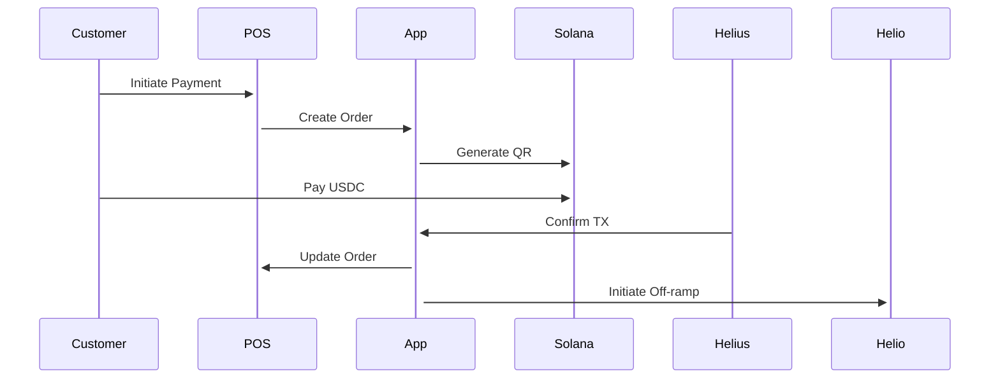
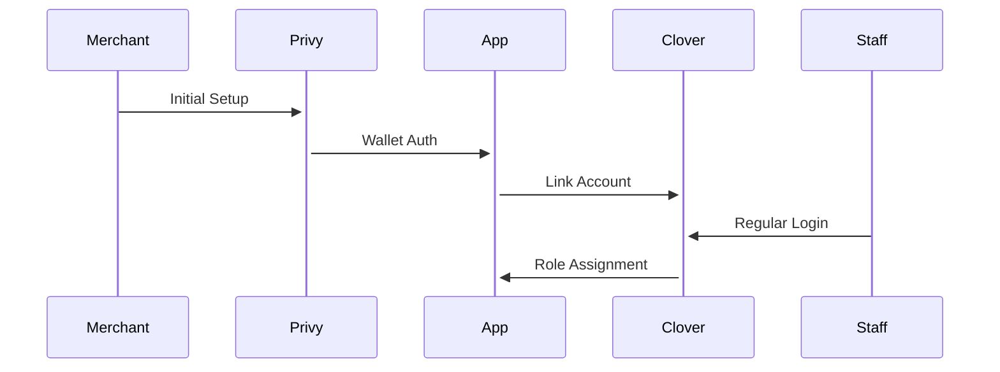

# System Architecture

This document outlines the complete system architecture of the Clover USDC Payment Gateway.

## System Components

### High-Level Architecture
```
┌─────────────────┐     ┌──────────────┐     ┌────────────────┐
│   Clover POS    │◄────┤  Payment App  │────►│  Solana Chain  │
└─────────────────┘     └──────────────┘     └────────────────┘
                              │
                        ┌─────┴─────┐
                        │  Services  │
                        └───────────┘
                             │
                    ┌────────┴───────┐
                    ▼                ▼
              ┌─────────┐      ┌─────────┐
              │ Helius  │      │  Helio  │
              └─────────┘      └─────────┘
```

### Core Components

1. **Frontend Layer**
   - Next.js 13+ App Router
   - TypeScript
   - React Components
   - Solana Pay Integration

2. **Backend Layer**
   - Next.js API Routes
   - Database Operations
   - External Service Integration
   - Authentication System

3. **Database Layer**
   - PostgreSQL
   - Core Tables:
     - Merchants
     - Transactions
     - Transfers

4. **Integration Layer**
   - Clover POS Integration
   - Helius (Transaction Monitoring)
   - Helio (Off-ramp)
   - Solana Chain Interaction

## Data Flow

### 1. Payment Flow


### 2. Authentication Flow


## Security Model

### Authentication System
1. **Initial Setup (Privy)**
   ```typescript
   interface PrivyAuth {
     walletAddress: string;
     merchantId: string;
     setupComplete: boolean;
   }
   ```

2. **Operational Auth (Clover)**
   ```typescript
   interface CloverAuth {
     merchantId: string;
     employeeId: string;
     role: 'OWNER' | 'ADMIN' | 'MANAGER' | 'EMPLOYEE';
   }
   ```

### Role-Based Access Control
```typescript
const rolePermissions = {
  OWNER: ['*'],
  ADMIN: ['manage_staff', 'view_all', 'process_payments', 'off_ramp'],
  MANAGER: ['manage_staff', 'view_transactions', 'process_payments'],
  EMPLOYEE: ['process_payments', 'view_transactions']
};
```

## Integration Points

### 1. Clover Integration
```typescript
interface CloverIntegration {
  createOrder(data: OrderData): Promise<Order>;
  updateOrder(id: string, data: Partial<OrderData>): Promise<Order>;
  getEmployeeRoles(): Promise<Role[]>;
}
```

### 2. Helius Integration
```typescript
interface HeliusIntegration {
  monitorTransaction(signature: string): Promise<void>;
  handleWebhook(payload: WebhookPayload): Promise<void>;
}
```

### 3. Helio Integration
```typescript
interface HelioIntegration {
  createTransfer(data: TransferData): Promise<Transfer>;
  getTransferStatus(id: string): Promise<TransferStatus>;
}
```

## Database Schema

### Core Tables

```sql
-- Merchants Table
CREATE TABLE merchants (
  id SERIAL PRIMARY KEY,
  clover_id VARCHAR(255) NOT NULL UNIQUE,
  wallet_address VARCHAR(255) NOT NULL,
  name VARCHAR(255) NOT NULL,
  status VARCHAR(50) NOT NULL,
  created_at TIMESTAMP DEFAULT CURRENT_TIMESTAMP
);

-- Transactions Table
CREATE TABLE transactions (
  id SERIAL PRIMARY KEY,
  merchant_id INTEGER REFERENCES merchants(id),
  clover_order_id VARCHAR(255) NOT NULL,
  amount DECIMAL(18,6) NOT NULL,
  status VARCHAR(50) NOT NULL,
  signature VARCHAR(255) UNIQUE,
  created_at TIMESTAMP DEFAULT CURRENT_TIMESTAMP
);

-- Transfers Table
CREATE TABLE transfers (
  id SERIAL PRIMARY KEY,
  merchant_id INTEGER REFERENCES merchants(id),
  transaction_id INTEGER REFERENCES transactions(id),
  amount DECIMAL(18,6) NOT NULL,
  status VARCHAR(50) NOT NULL,
  helio_reference VARCHAR(255) UNIQUE,
  created_at TIMESTAMP DEFAULT CURRENT_TIMESTAMP
);
```

## Error Handling

### Global Error Structure
```typescript
interface AppError {
  code: string;
  message: string;
  service?: 'clover' | 'helius' | 'helio';
  context?: Record<string, unknown>;
}
```

### Error Handling Strategy
1. Service-specific error handling
2. Global error middleware
3. Error logging and monitoring
4. User-friendly error messages

## Monitoring and Logging

### Key Metrics
1. Transaction Success Rate
2. Payment Processing Time
3. Off-ramp Success Rate
4. API Response Times
5. Error Rates

### Logging Strategy
1. Structured JSON Logging
2. Error Context Capture
3. Performance Metrics
4. Security Events

## Best Practices

### Security
1. Input Validation
2. Request Rate Limiting
3. Secure Token Storage
4. Regular Security Audits

### Performance
1. Query Optimization
2. Caching Strategy
3. Connection Pooling
4. Resource Management

### Development
1. Type Safety
2. Code Documentation
3. Testing Coverage
4. Code Review Process