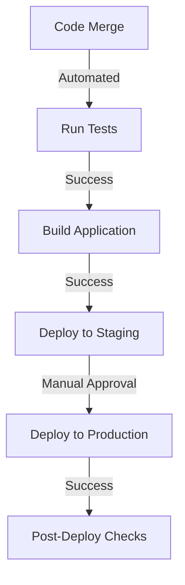

# Deployment Guide

This document outlines the deployment process and environments for the Clover USDC Payment Gateway.

## Deployment Environments

### Environment Structure
```
┌─────────────┐   ┌─────────────┐   ┌─────────────┐
│ Development │ → │   Staging   │ → │ Production  │
└─────────────┘   └─────────────┘   └─────────────┘
```

### Environment Configuration

```bash
# Development (.env.development)
NODE_ENV=development
SOLANA_NETWORK=devnet
API_URL=https://dev-api.example.com

# Staging (.env.staging)
NODE_ENV=staging
SOLANA_NETWORK=devnet
API_URL=https://staging-api.example.com

# Production (.env.production)
NODE_ENV=production
SOLANA_NETWORK=mainnet
API_URL=https://api.example.com
```

## Deployment Process

### 1. Build Process

```bash
# Build script
npm run build

# Build configuration (next.config.js)
module.exports = {
  output: 'standalone',
  experimental: {
    outputFileTracingRoot: undefined,
  }
}
```

### 2. Deployment Steps



### 3. Database Migrations

```bash
# Run migrations
npm run migration:up

# Rollback steps
npm run migration:down
```

## Release Process

### 1. Version Control

```bash
# Version bump
npm version patch|minor|major

# Tag release
git tag -a v1.0.0 -m "Release v1.0.0"
git push origin v1.0.0
```

### 2. Release Checklist

- [ ] All tests passing
- [ ] Database migrations ready
- [ ] Environment variables updated
- [ ] Documentation updated
- [ ] Security checks completed
- [ ] Performance benchmarks met

### 3. Release Commands

```bash
# Staging deployment
npm run deploy:staging

# Production deployment
npm run deploy:production
```

## Infrastructure Setup

### 1. Cloud Resources

```terraform
# Example Terraform configuration
resource "aws_ecs_cluster" "main" {
  name = "payment-gateway-cluster"
}

resource "aws_rds_cluster" "main" {
  cluster_identifier = "payment-gateway-db"
  engine            = "aurora-postgresql"
  database_name     = "payment_gateway"
}
```

### 2. Networking

```terraform
# VPC configuration
resource "aws_vpc" "main" {
  cidr_block = "10.0.0.0/16"
  
  tags = {
    Name = "payment-gateway-vpc"
  }
}
```

## Monitoring Setup

### 1. Health Checks

```typescript
// Health check endpoint
app.get('/health', (req, res) => {
  const health = {
    uptime: process.uptime(),
    status: 'OK',
    timestamp: Date.now()
  };
  res.send(health);
});
```

### 2. Metrics Collection

```typescript
// Metrics configuration
const metrics = {
  transaction_count: new Counter({
    name: 'payment_transactions_total',
    help: 'Total number of payment transactions'
  }),
  processing_time: new Histogram({
    name: 'payment_processing_duration_seconds',
    help: 'Payment processing duration'
  })
};
```

## Rollback Procedures

### 1. Application Rollback

```bash
# Rollback to previous version
npm run rollback

# Database rollback
npm run db:rollback
```

### 2. Recovery Steps

1. Identify failure point
2. Execute rollback
3. Verify system state
4. Notify stakeholders
5. Document incident

## Security Measures

### 1. SSL Configuration

```nginx
# NGINX SSL configuration
server {
    listen 443 ssl;
    server_name example.com;
    
    ssl_certificate /etc/ssl/certs/example.com.crt;
    ssl_certificate_key /etc/ssl/private/example.com.key;
    
    ssl_protocols TLSv1.2 TLSv1.3;
    ssl_ciphers HIGH:!aNULL:!MD5;
}
```

### 2. Environment Security

```bash
# Security headers
npm install helmet
app.use(helmet());

# Rate limiting
npm install express-rate-limit
app.use(rateLimit({
  windowMs: 15 * 60 * 1000,
  max: 100
}));
```

## Backup Strategy

### 1. Database Backups

```bash
# Automated backup script
#!/bin/bash
DATE=$(date +%Y%m%d)
pg_dump -Fc payment_gateway > backup_$DATE.dump
aws s3 cp backup_$DATE.dump s3://backups/
```

### 2. Recovery Testing

```bash
# Restore from backup
pg_restore -d payment_gateway backup_20231101.dump

# Verify data integrity
npm run verify:data
```

## Performance Optimization

### 1. Caching Strategy

```typescript
// Redis cache configuration
const cache = new Redis({
  host: process.env.REDIS_HOST,
  port: process.env.REDIS_PORT,
  maxRetriesPerRequest: 3
});
```

### 2. Load Balancing

```nginx
# Load balancer configuration
upstream payment_gateway {
    server 10.0.0.1:3000;
    server 10.0.0.2:3000;
    server 10.0.0.3:3000;
}
```

## Troubleshooting

### Common Issues

1. **Deployment Failures**
   - Check build logs
   - Verify environment variables
   - Check service dependencies
   - Review resource allocation

2. **Database Issues**
   - Check connection strings
   - Verify migration status
   - Monitor connection pool
   - Review query performance

3. **Performance Issues**
   - Monitor resource usage
   - Check error rates
   - Review response times
   - Analyze load patterns

## Best Practices

### 1. Deployment
- Use blue-green deployment
- Implement feature flags
- Automate where possible
- Regular backup testing

### 2. Monitoring
- Set up alerts
- Monitor key metrics
- Log important events
- Regular health checks

### 3. Security
- Regular security audits
- Update dependencies
- Monitor access logs
- Implement rate limiting