# Dependency Graph Visualization

## Overview
This document provides a comprehensive visualization and analysis of the project's dependency relationships, highlighting the connections between different components, modules, and files.

## Core Dependencies

### Component Dependencies
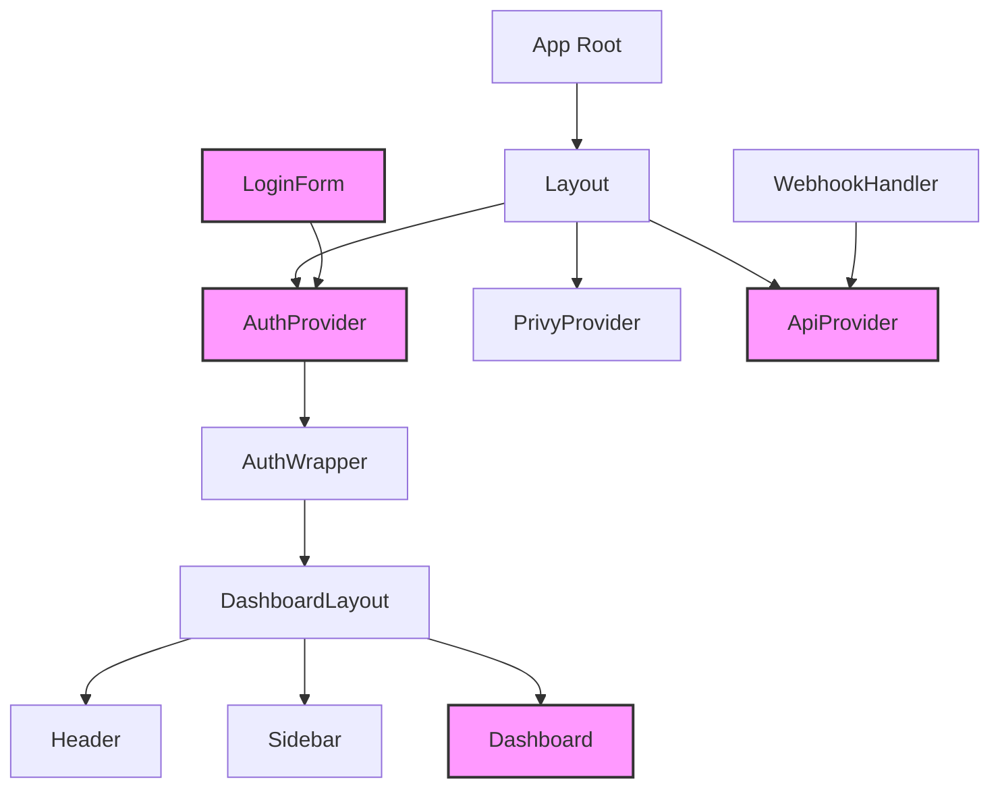

### Type System Dependencies
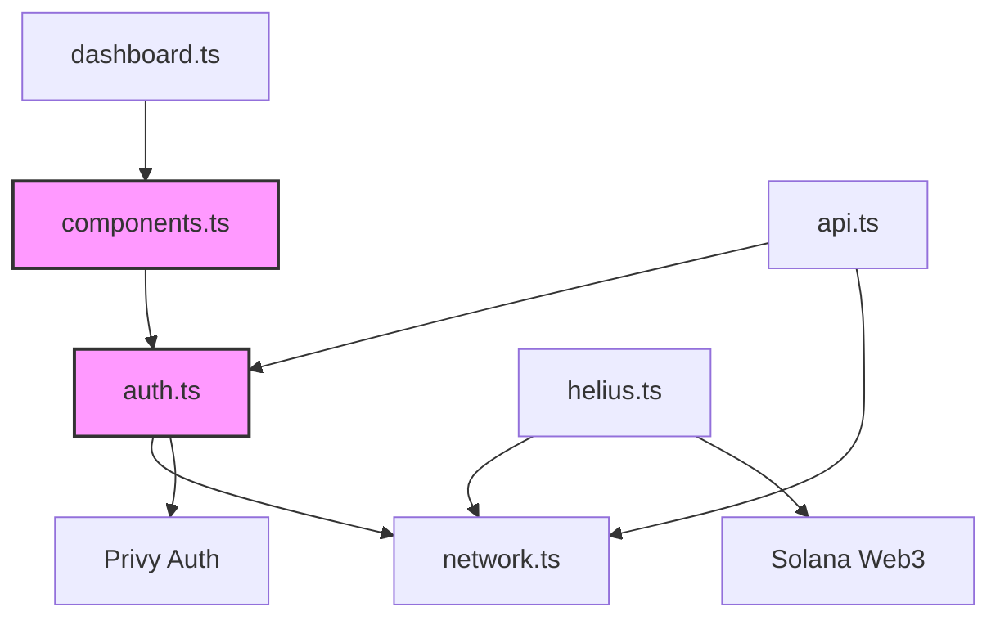

### API Dependencies
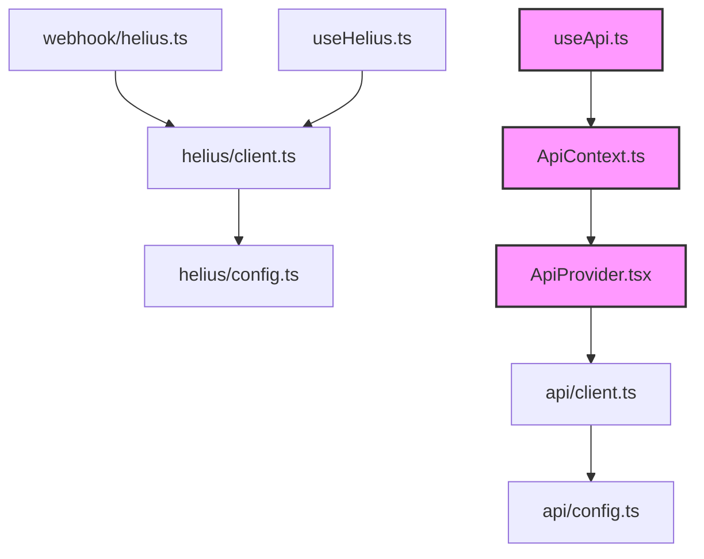

## Critical Paths

### Authentication Flow
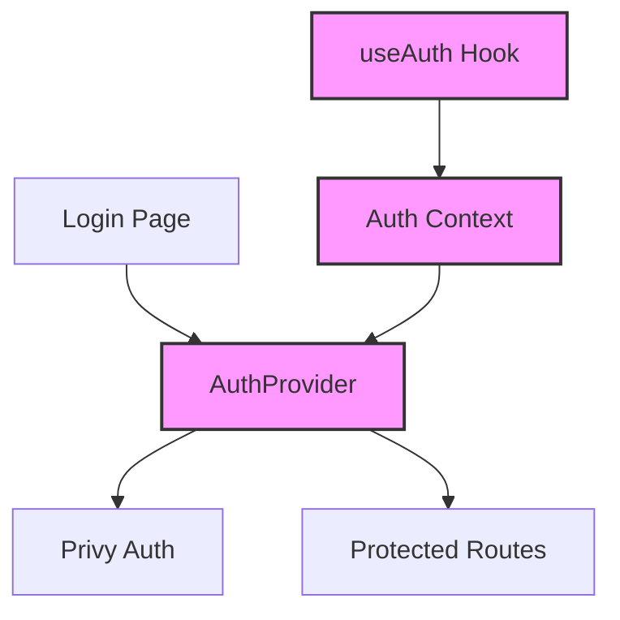

### Data Flow
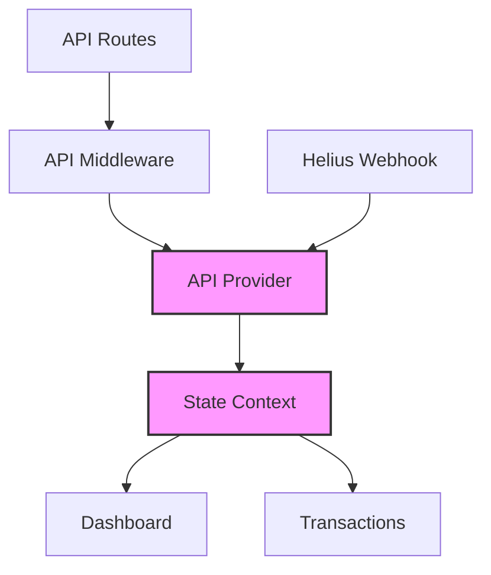

## Dependency Clusters

### UI Component Cluster
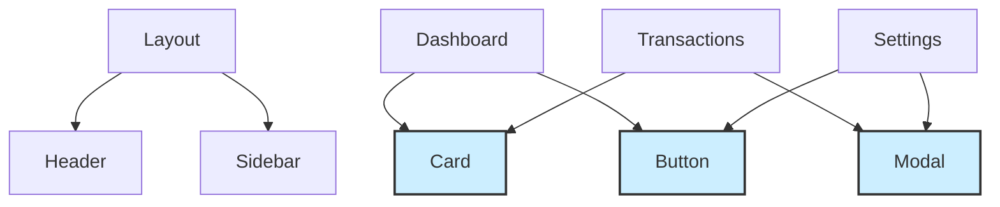

## External Dependencies

### Third-Party Integration
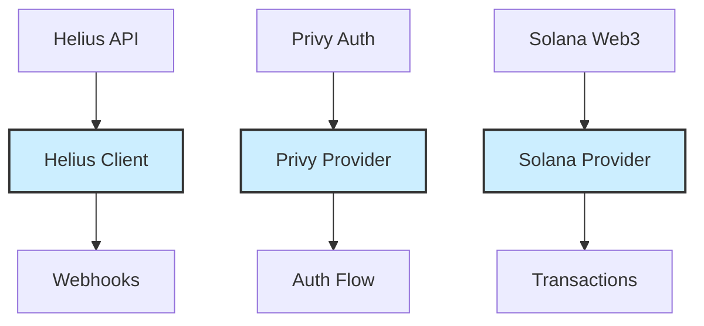

## Module Relationships

### Authentication Flow
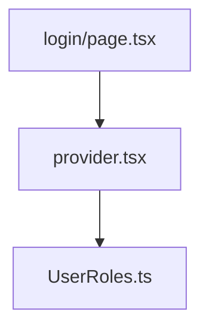

### Test Dependencies
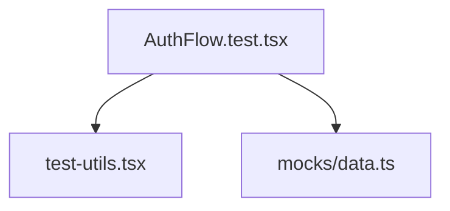

## Circular Dependencies

### Identified Circular Dependencies
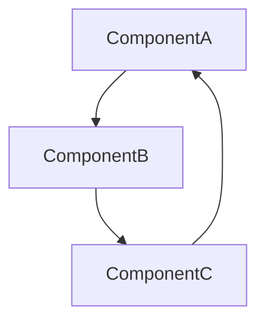

### Resolution Strategies
- List of circular dependencies found
- Impact analysis
- Proposed solutions

## Critical Paths

### Core Application Flow
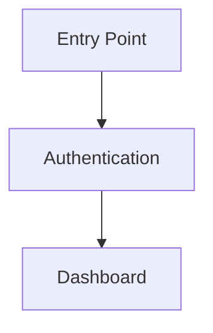

### Data Flow
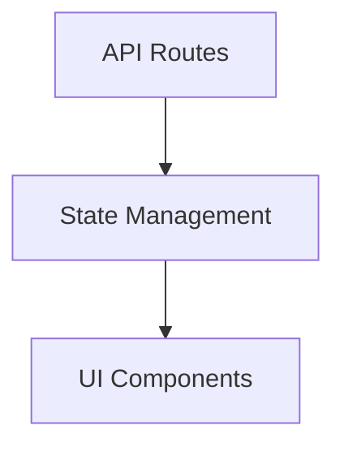

## Dependency Clusters

### UI Component Cluster
- Primary components
- Shared components
- Layout components
- Dependencies between them

### Utility Function Cluster
- Helper functions
- Shared utilities
- Import relationships

### Configuration Cluster
- Config files
- Environment variables
- Dependencies

## External Dependencies

### Third-Party Libraries
- React/Next.js dependencies
- Testing libraries
- Blockchain libraries
- Other external dependencies

### Integration Points
- Helius integration
- Helio integration
- Other external service integrations

## Dependency Analysis

### High-Impact Dependencies
- Critical path components
- Frequently imported modules
- Core type definitions

### Isolated Modules
- Stand-alone components
- Independent utilities
- Self-contained modules

### Dependency Metrics
- Import frequency
- Dependency depth
- Coupling metrics

## Optimization Opportunities

### Structural Improvements
- Potential restructuring opportunities
- Module consolidation possibilities
- Separation of concerns improvements

### Performance Considerations
- Import size impact
- Bundle optimization opportunities
- Code splitting suggestions

## Next Steps
- Priority areas for optimization
- Suggested structural changes
- Implementation recommendations

Last Updated: [Date]
Note: This visualization will be updated as new dependencies are discovered during the audit process.