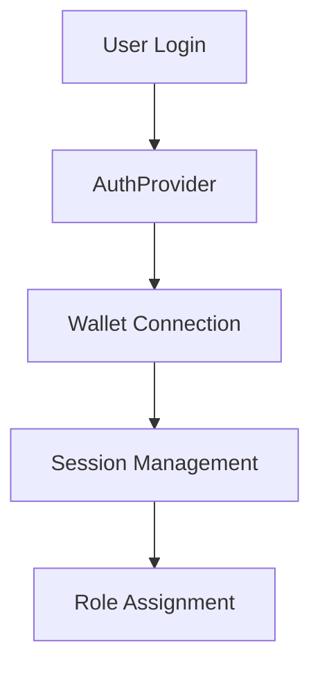
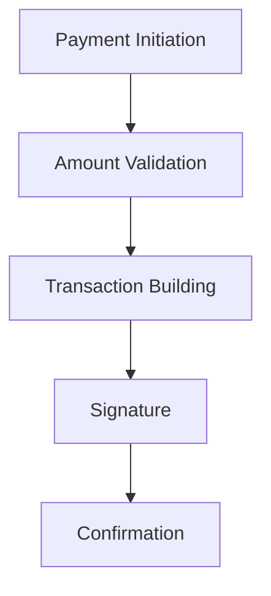
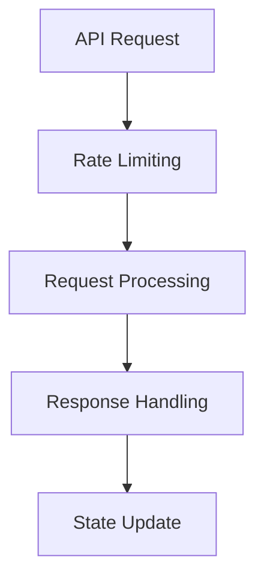

# Vulnerability Analysis and Impact Assessment

## Overview
Based on npm audit results: 26 vulnerabilities identified
- 3 High severity issues
- 23 Critical severity issues

## 1. Dependency Analysis

### Critical Dependencies
```
Current Audit State:
Total Packages: 1127
Vulnerable Packages: 26
Funding Requests: 224
```

### Key Affected Areas
1. Authentication System
   - Privy Integration
   - Wallet Connections
   - Session Management

2. Payment Processing
   - Helius Integration
   - Solana Pay Implementation
   - Transaction Signing

3. API Integration
   - Webhook Handlers
   - RPC Connections
   - Rate Limiting

4. Core Infrastructure
   - React/Next.js Framework
   - TypeScript Dependencies
   - Testing Infrastructure

## 2. Impact Categories

### Authentication Flow Impact

#### Affected Components
- `src/providers/AuthProvider.tsx`
- `src/hooks/useAuth.ts`
- `src/components/auth/AuthFlow.tsx`

#### Potential Vulnerabilities
1. Session Management
   - Token handling
   - Session persistence
   - Authentication state management

2. Wallet Integration
   - Connection security
   - Signature verification
   - Key management

3. Role-Based Access
   - Permission validation
   - Role assignment
   - Access control enforcement

#### Risk Assessment
- Severity: HIGH
- Exposure: Authentication system compromises could affect all user interactions
- Mitigation Priority: IMMEDIATE

### Payment Processing Impact

#### Affected Components
- `src/lib/helius/client.ts`
- `src/lib/blockchain/rateLimiter.ts`
- `src/lib/blockchain/cache.ts`

#### Potential Vulnerabilities
1. Transaction Processing
   - Signature validation
   - Amount verification
   - State management

2. Rate Limiting
   - Request throttling
   - Queue management
   - Error handling

3. Cache Security
   - Data persistence
   - State management
   - Memory handling

#### Risk Assessment
- Severity: CRITICAL
- Exposure: Direct impact on financial transactions
- Mitigation Priority: IMMEDIATE

### Wallet Integration Impact

#### Affected Components
- `src/components/PrivyClientWrapper.tsx`
- `src/lib/helius/client.ts`
- `src/hooks/useWallet.ts`

#### Potential Vulnerabilities
1. Connection Security
   - Provider validation
   - Network security
   - State management

2. Transaction Signing
   - Signature validation
   - Key management
   - Message verification

3. State Management
   - Connection persistence
   - Error handling
   - Recovery mechanisms

#### Risk Assessment
- Severity: HIGH
- Exposure: Critical for all wallet interactions
- Mitigation Priority: HIGH

### Transaction Signing Impact

#### Affected Components
- `src/lib/helius/client.ts`
- `src/utils/transaction.ts`
- `src/hooks/useTransaction.ts`

#### Potential Vulnerabilities
1. Signature Verification
   - Key validation
   - Message integrity
   - Hash verification

2. Transaction Building
   - Input validation
   - Fee calculation
   - Instruction verification

3. Error Handling
   - Failed transactions
   - Network errors
   - State recovery

#### Risk Assessment
- Severity: CRITICAL
- Exposure: Direct impact on transaction security
- Mitigation Priority: IMMEDIATE

### API Integration Impact

#### Affected Components
- `src/app/api/webhooks/helius.ts`
- `src/providers/ApiProvider.tsx`
- `src/hooks/useApi.ts`

#### Potential Vulnerabilities
1. Request Handling
   - Input validation
   - Rate limiting
   - Error handling

2. Response Processing
   - Data validation
   - Error handling
   - State management

3. Webhook Security
   - Signature verification
   - Request validation
   - Rate limiting

#### Risk Assessment
- Severity: HIGH
- Exposure: All external API interactions
- Mitigation Priority: HIGH

## 3. Critical Paths

### Authentication Flow


### Payment Processing


### API Integration


## 4. Mitigation Strategy

### Immediate Actions
1. Update critical dependencies
2. Implement security patches
3. Enhance error handling
4. Strengthen input validation

### Short-term Fixes
1. Implement additional security measures
2. Enhance monitoring
3. Update documentation
4. Add security tests

### Long-term Solutions
1. Architectural improvements
2. Regular security audits
3. Automated vulnerability scanning
4. Enhanced error recovery

## 5. Recovery Steps

### Phase 1: Critical Fixes
1. Update vulnerable dependencies
2. Patch security issues
3. Implement immediate fixes
4. Verify critical paths

### Phase 2: Validation
1. Test authentication flow
2. Verify payment processing
3. Validate API integration
4. Check wallet connections

### Phase 3: Documentation
1. Update security documentation
2. Document new procedures
3. Update recovery plans
4. Enhance monitoring docs

## 6. Monitoring Plan

### Security Monitoring
1. Regular vulnerability scans
2. Dependency audits
3. Security log analysis
4. Performance monitoring

### Performance Monitoring
1. Transaction latency
2. API response times
3. Error rates
4. System resources

### Error Tracking
1. Authentication failures
2. Transaction errors
3. API failures
4. System errors

## Next Steps

### Immediate Actions
1. Begin dependency updates
2. Implement critical patches
3. Enhance monitoring
4. Update documentation

### Validation Requirements
1. Security testing
2. Performance validation
3. Integration testing
4. User acceptance testing

Last Updated: 2024-02-16